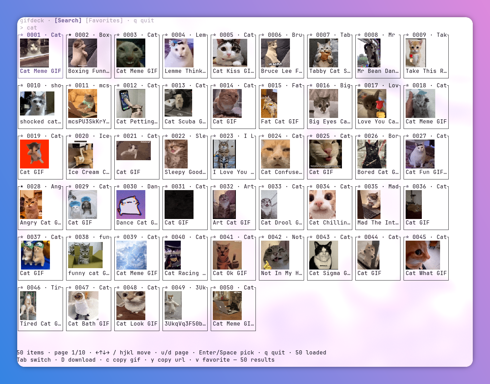

# gifdeck

<a href="https://crates.io/crates/gifdeck">
    
</a>
<a href="https://github.com/oneshinyboi/gifdeck/actions/workflows/ci.yml">
    
</a>
<a href="https://github.com/oneshinyboi/homebrew-tap">
    
</a>
<a href="https://www.rust-lang.org">
    
</a>

A GIF picker for the terminal. Search GIPHY and KLIPY, browse results in
an animated grid, favorite the ones you love, and send them to the
clipboard — as the actual animated GIF file, or just as a link.

- **Search** — GIPHY and KLIPY, with paging
- **Favorites** — stored locally by default, or synced through your own
  self-hosted favorites server,
  [gifdeck-server](https://github.com/oneshinyboi/gifdeck-server)
- **Live previews** — animated GIF cells in Kitty, Ghostty, and other
  terminals that support the Kitty graphics protocol; a clean
  title-only grid everywhere else
- **Clipboard-ready** — copy a GIF as a real `image/gif` attachment, or
  just its URL



## Contents

- [Install](#install)
- [Building](#building)
- [Quick start](#quick-start)
- [Usage](#usage)
- [The picker](#the-picker)
- [Favorites](#favorites)
- [Configuration](#configuration)
- [File locations](#file-locations)
- [Development](#development)

## Install

**cargo** (any platform with Rust):

```
cargo install gifdeck
```

With `cargo-binstall` installed, `cargo binstall gifdeck` grabs the
prebuilt release binary instead of compiling.

**Homebrew** (macOS and Linux):

```
brew install oneshinyboi/tap/gifdeck
```

**Prebuilt binaries** — download from
[GitHub releases](https://github.com/oneshinyboi/gifdeck/releases):

| Archive                                               | Platform                        |
| ----------------------------------------------------- | ------------------------------- |
| `gifdeck-<ver>-x86_64-unknown-linux-gnu.tar.gz`       | Linux x86_64 (glibc)            |
| `gifdeck-<ver>-x86_64-unknown-linux-musl.tar.gz`      | Linux x86_64 (static, any distro) |
| `gifdeck-<ver>-aarch64-unknown-linux-gnu.tar.gz`      | Linux aarch64                   |
| `gifdeck-<ver>-aarch64-apple-darwin.tar.gz`           | macOS Apple silicon             |
| `gifdeck-<ver>-x86_64-pc-windows-msvc.zip`            | Windows x86_64                  |

Intel Macs are not covered by prebuilt binaries — use
`cargo install gifdeck` there instead.

Verify a download against the release's `SHA256SUMS`:

```
grep linux-gnu.tar.gz SHA256SUMS | sha256sum -c -
```

**Fedora** — RPMs are built in Copr from release tags (via Packit):

```
dnf copr enable shinediamond295/gifdeck
dnf install gifdeck
```

Platform notes: clipboard actions need `wl-copy` (Wayland) or `xclip`
(X11); on Windows they are unavailable and report the failure in the
footer. Inline animated previews require a terminal with Kitty graphics
support (Kitty, Ghostty, …); everywhere else the grid falls back to
titles and the picker stays fully usable.

## Building

Requires Rust. From the project root:

```
cargo build --release
```

The binary lands at `target/release/gifdeck`. Tests:

```
cargo test
```

## Quick start

Searching needs an API key. Put at least one of `GIPHY_API_KEY` or
`KLIPY_API_KEY` in `~/.config/gifdeck/config.json`:

```json
{ "GIPHY_API_KEY": "…" }
```

(All values come from this file — there is no environment-variable
fallback. See [Configuration](#configuration).)

Then run:

```
gifdeck
```

That's it — the picker opens with a focused search box. Type a query,
press Enter, move around with the arrow keys (or `h j k l`), and press
Enter on a GIF to choose it.

Without a key the picker still opens — favorites work — but searches
fail with `KLIPY_API_KEY is not configured` in the footer until you add
one.

## Usage

```
gifdeck                     # shorthand for `gifdeck tui`
gifdeck search <query> [--source auto|giphy|klipy] [--max N] [--json]
gifdeck favs [--json] [--export] [--import]
gifdeck tui [<query>] [--favs]
```

Examples:

```
# Search KLIPY for "cat", print 2 direct GIF URLs
gifdeck search cat --source klipy --max 2

# Same, as JSON
gifdeck search cat --json

# List favorites (server when configured, otherwise the local store)
gifdeck favs

# Copy the server's favorites into the local store (server mode only)
gifdeck favs --export

# Push the local store's favorites onto the server (server mode only)
gifdeck favs --import

# Open the picker with the search pre-run for "cat"
gifdeck tui cat

# Open the picker directly on the Favorites tab
gifdeck tui --favs
```

Running `gifdeck search` outside a TTY just prints URLs (one per line),
so it pipes nicely:

```
gifdeck search cat --max 5 | head
```

## The picker

The picker has two tabs sharing one grid: **Search** (your query's
results) and **Favorites**. Cells show inline, animated GIF previews on
Kitty-protocol terminals and fall back to titles-only elsewhere — the
picker works everywhere, it just looks simpler without graphics support.

```
Tab: [Search] [Favorites]  q quit
 > type a query… (/ focus, Enter search)
 ☆ 0001 · title   ★ 0002 · title   …
  12/50 · page 1/3 · u/d page · D download · c copy gif · y copy url · v favorite
```

### Keys

```
← → ↑ ↓ / h j k l   move (wrapping)
d / u               next / previous page
/                   focus the search box (Search tab)
(type…)             edit the query — Backspace deletes, Ctrl+U clears,
                    Esc clears then blurs; search runs on Enter only
Enter               run the search / choose the selected GIF (prints its URL)
Space               choose the selected GIF
Tab                 switch between Search and Favorites
c                   copy the GIF file to the clipboard as image/gif
D                   download the GIF to your downloads folder
y                   copy the GIF URL as text
v                   favorite / unfavorite the selected GIF
q / Esc / Ctrl+C    quit (Esc clears/blurs the search box when focused)
```

Notes:

- **Paging** — `d`/`u` load the next/previous page (Ctrl+U clears the
  search box). The footer shows `page N/M` when the source reports a
  total and `page N` otherwise; at the end of the results the current
  page is kept and the footer says there are no more.
- **Choosing** — Enter/Space print the chosen GIF's URL and copy it to
  the clipboard when `wl-copy` or `xclip` is installed.
- **Errors** — network hiccups and backend errors show up in the footer;
  the picker never crashes over them.

## Favorites

Favorites have exactly one home, chosen by your config. The footer tells
you which mode you're in (`★ saved to favorites` vs.
`★ saved to local favorites`).

- **Local mode** (default) — favorites live in a plain JSON file at
  `~/.local/share/gifdeck/favorites.json`. No server, no account, works
  out of the box.
- **Server mode** — favorites sync through a self-hosted favorites
  server (`X-Auth-Token` auth), so the same list follows you across
  machines. [gifdeck-server](https://github.com/oneshinyboi/gifdeck-server)
  is the reference implementation; its README covers the API and
  deployment.

The two never mix on their own. To move between them, use the explicit
transfer commands:

```
gifdeck favs --export    # server → local file (overwrites the file)
gifdeck favs --import    # local file → server (upserts by id)
```

`--import` attempts every favorite even if some fail; failures are
listed one per line with the reason, and the command exits non-zero when
anything failed.

**Switching from server mode back to local:** run `--export` first (to
keep a local copy), then either set `"FAVORITES_MODE": "local"` in the
config (the token stays saved for later) or remove
`GIFDECK_FAVORITES_TOKEN`.

### Use tracking

Every time you *use* a favorited GIF — pick it (Enter/Space), copy the
file (`c`), or copy the URL (`y`) — gifdeck bumps its use count and
last-used timestamp. Favorites are listed most-used first (then
most-recently used, then by id), and the Favorites tab re-sorts right in
front of you, so the GIFs you actually reach for float to the top.

Non-favorites are not tracked. Using the clipboard requires `wl-copy`
(Wayland) or `xclip` (X11); without either, `c`/`y` report the failure
in the footer.

## Configuration

gifdeck reads one JSON config file at startup:

```
~/.config/gifdeck/config.json
```

(Linux path; other platforms follow the OS convention. Point the
`GIFDECK_CONFIG` environment variable at an alternate file to override.)

No key is mandatory to launch — a missing or empty config file is fine,
and gifdeck runs with local favorites. But the keys are not equally
optional: searching needs at least one provider API key, and
server-mode favorites need the favorites API and token.

| Key                       | Required for                                     | Meaning                                          |
| ------------------------- | ------------------------------------------------ | ------------------------------------------------ |
| `KLIPY_API_KEY`           | searching (one of the two keys suffices)         | KLIPY search API key                             |
| `GIPHY_API_KEY`           | searching (one of the two keys suffices)         | GIPHY search API key                             |
| `GIFDECK_FAVORITES_API`   | server-mode favorites only                       | gifdeck-server base URL, e.g. `https://your-host/api/v1` (no default) |
| `GIFDECK_FAVORITES_TOKEN` | server-mode favorites                            | favorites server auth token                      |
| `FAVORITES_MODE`          | forcing a favorites mode (otherwise optional)    | `server` or `local`                              |

Example:

```json
{
  "GIPHY_API_KEY": "…",
  "GIFDECK_FAVORITES_API": "https://favs.example.com/api/v1",
  "GIFDECK_FAVORITES_TOKEN": "…"
}
```

Mode rules, in one breath: with a token configured, favorites go to the
server; without one, they stay local. `FAVORITES_MODE` overrides that —
`"local"` uses the file even when a token is configured (handy for
keeping the credentials around), and `"server"` targets the server even
without a token (requests go unauthenticated, and errors surface in the
footer). An unknown `FAVORITES_MODE` value prints a warning and falls
back to the token rule.

A missing config file is fine — gifdeck runs with local favorites. An
invalid one prints a warning and is treated as empty. Unknown keys are
ignored, blank values count as unset, and values are never logged. All
configuration values are read from the file only; setting
`KLIPY_API_KEY`-style environment variables has no effect.

## File locations

| What                  | Where                                    |
| --------------------- | ---------------------------------------- |
| Config                | `~/.config/gifdeck/config.json`          |
| Local favorites       | `~/.local/share/gifdeck/favorites.json`  |
| Temp files (clipboard)| `~/.cache/gifdeck/`                      |

## Development

Source layout, for hacking on gifdeck:

- `src/main.rs` — CLI dispatch and picker session setup
- `src/cli.rs` — clap definitions
- `src/config.rs` — config file loading, favorites mode resolution
- `src/providers.rs` — GIPHY/KLIPY search clients
- `src/favs.rs` — favorites backend (server client / local store)
- `src/store.rs` — local favorites store (atomic JSON writes)
- `src/app.rs` — the tabbed picker: state, keymap, event loop, rendering
- `src/preview.rs` — bounded LRU preview cache, async GIF loader/decoder
- `src/clipboard.rs` — wl-copy/xclip integration
